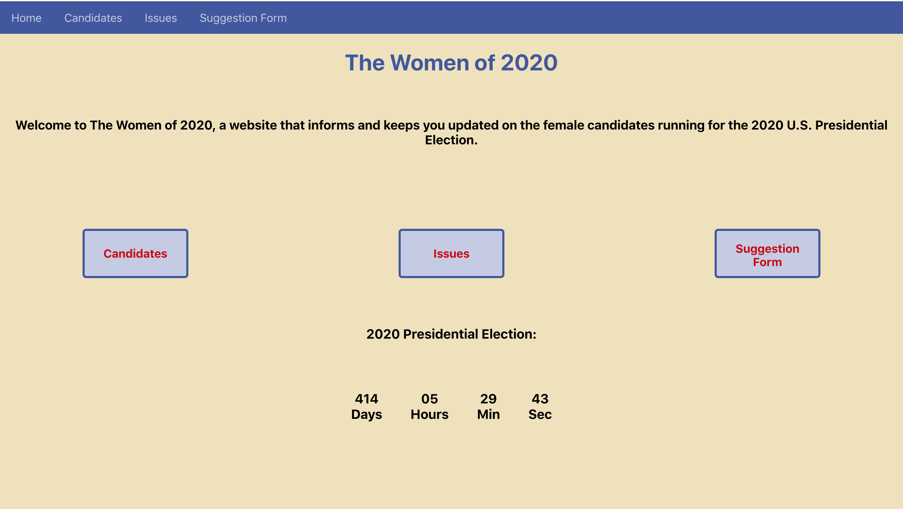

# The Women of 2020
Welcome to The Women of 2020, a website that informs and keeps users updated on all of the female candidates running for the 2020 United States Presidential Election.

This website is specifically created to detail the list of candidates and their opinions on the most debated political issues, all while not purposefully mentioning their party affiliation. 

Users are able to see a list of the candidates, their status within the election, and can be re-directed to the candidate's personal website for the election. Users can also see a list of the main political issues heavily debated, and can see where each candidate falls in terms of their political views. Lastly, there is also a suggestion form, where users can send a message if they think any information is inaccurate, or if they wish for a specific issue to be added to the website. 

  

  